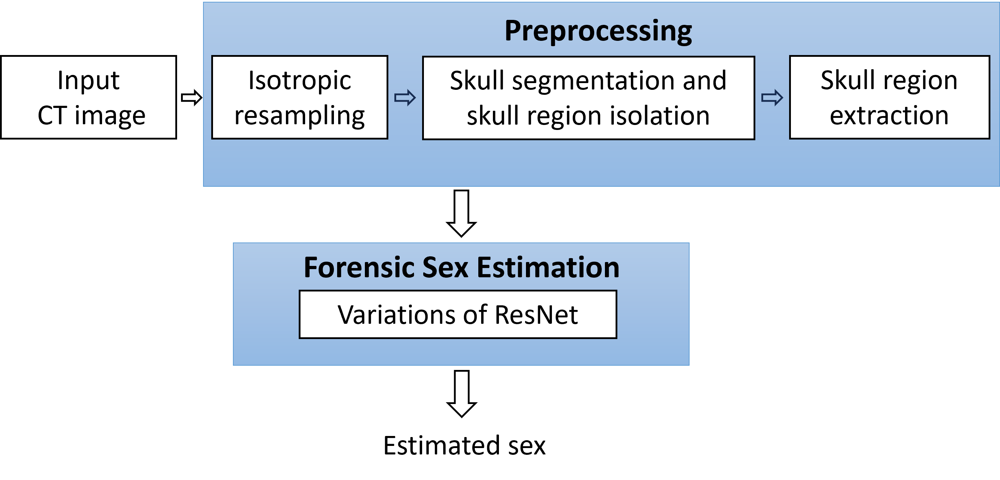

# ForensicSexEstimation
A deep learning framework for forensic sex estimation from 3D CT





# Environment setup

## Setup conda environment Python3.9

>```
>git clone https://github.com/aehrc/ForensicSexEstimation.git
>cd ForensicSexEstimation
>pip install -r requirements.txt
>```

For TotalSegmentator installation, please use the v2.0.5 release:

https://github.com/wasserth/TotalSegmentator/releases/tag/v2.0.5


Please place your dicom CT data in the folder ./Cranial CT data

## Data preprocessing

Converting dcm file into nifti, isotropic resampling to 1X1X1mm, skull segmentation via TotalSegmentator, skull region extraction

>```
>cd ./run
>python3.9 run_preprocessing.py
>```

* The preprocessed images will be save into ./Cranial CT data/Cranial CT nifti isotropic crop, and the preprocessed skull masks will be saved into ./Cranial CT data/Cranial CT isotropic segmentations crop

* The training/validation(5-fold cross-validation) and testing partition need to be specified in the ./data_partition/Case_partition.xlsx file. 

## Training

>```
>python3.9 train.py --mdl_type [model_type] --input_mode [input_mode]
>```

The model_type and input_mode variables can be selected as shown in the table below.
After training, the models can be found under folder ForensicSexEstimation.

<table>
  <tr>
    <th>Model Type</th>
    <th>Model Type Explanation</th>
    <th>Input Mode</th>
    <th>Input Mode Explanation</th>
  </tr>
  <tr>
    <td rowspan="3">ResNet_two_output</td>
    <td rowspan="3">Model generates Walker scores and forensic sex sequentially.</td>
    <td>image</td>
    <td>Use image as input.</td>
  </tr>
  <tr>
    <td>image_skull</td>
    <td>Use both image and the skull mask as input in 2 channels.</td>
  </tr>
  <tr>
    <td>skull</td>
    <td>Use the intersection of image and skull mask (image ∩ skull mask) as input.</td>
  </tr>
  <tr>
    <td rowspan="3">ResNet_auxiliary</td>
    <td rowspan="3">Model architecture with auxiliary tasks to estimate both Walker scores and forensic sex.</td>
    <td>image</td>
    <td> </td>
  </tr>
  <tr>
    <td>image_skull</td>
    <td> </td>
  </tr>
  <tr>
    <td>skull</td>
    <td> </td>
  </tr>
  <tr>
    <td rowspan="3">ResNet_single_output</td>
    <td rowspan="3">Model only generates forensic sex estimation.</td>
    <td>image</td>
    <td> </td>
  </tr>
  <tr>
    <td>image_skull</td>
    <td> </td>
  </tr>
  <tr>
    <td>skull</td>
    <td> </td>
  </tr>
</table>

* For information on the Walker scores, please refer to:
> ```
> @article{walker2008sexing, 
>   title={Sexing skulls using discriminant function analysis of visually assessed traits}, 
>   author={Walker, Phillip L}, 
>   journal={American Journal of Physical Anthropology: The Official Publication of the American Association of Physical Anthropologists}, 
>   volume={136}, 
>   number={1}, 
>   pages={39--50}, 
>   year={2008}, 
>   publisher={Wiley Online Library} 
> }
> ```


## Evaluate

After training completed and before testing, the probability thresholds need to be determinded on the validation set.

>```
>cd ./run
>python3.9 evaluate.py --mdl_type [model_type] --input_mode [input_mode]
>```


## Testing

* Generating test outcomes

>```
>cd ./run
>python3.9 test.py --mdl_type [model_type] --input_mode [input_mode]
>```

* Calculate testing performance

>```
>python3.9 calculate_test_performance.py --mdl_type [model_type] --input_mode [input_mode]
>```


The sex estimation results for the testing data can be found under the 'test' folder in the model folders.

## Weights 

Trained weights(ResNet_model_weights.zip
) are available for image ∩ skull mask as input at: https://github.com/aehrc/ForensicSexEstimation/releases/tag/Weights.

Please place the model folders under folder ForensicSexEstimation.


